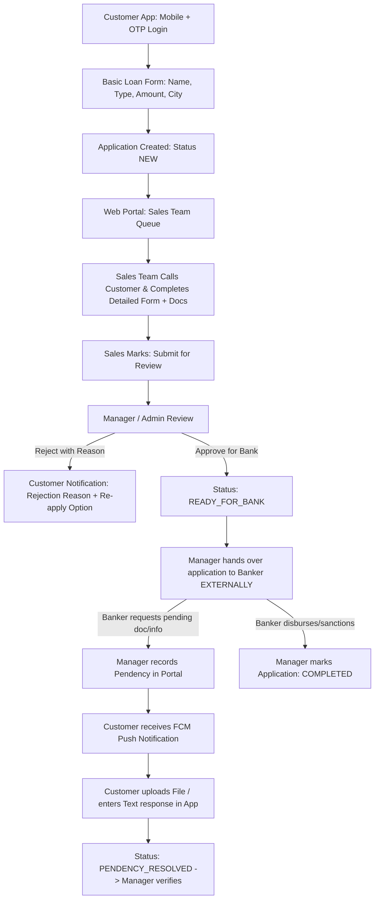

# Loan Application - Product Requirements Document & Technical Architecture

## 1. Project Overview & Scope
- **Project Name**: Loan Application & Lead Collection Management System
- **Core Scope**: Customer Lead Capture (Flutter Mobile App) + Sales Completion & Manager Quality Review (Web Portal) + External Banker Handoff & Customer Pendency Notification Cycle.
- **Out of Scope (By Design)**: Direct Banking LOS APIs, automatic disbursement webhooks, and automated underwriting sanction engines. External banking processing is conducted outside the software platform.

---

## 2. Architecture & Monorepo Structure
- **Monorepo Layout**:
  - `mobile/`: Flutter Mobile App (Customer-facing, State Management: BLoC / Cubit)
  - `backend/`: Laravel Web Portal & REST API (Sales/Manager Dashboard, MySQL Database, Sanctum Auth)
- **Role-Based Access Control (RBAC)**:
  1. **Customer**: Mobile + OTP Login (Single active application per mobile number).
  2. **Sales Executive**: Web portal login. Reviews incoming leads, contacts applicant via phone, gathers required documentation, populates client-defined fields, and submits for manager review.
  3. **Manager / Admin**: Global overview. Reviews submitted applications, rejects with mandatory reason, marks "Ready for Bank" for external handoff, and registers banker pendencies requiring customer resolution.

---

## 3. End-to-End Workflow & SOP

---

## 4. Application Lifecycle & State Machine
| Status Code | Description | Next Allowed State | Authorized Roles |
|---|---|---|---|
| `NEW` | Basic application submitted via Customer App | `IN_PROGRESS` | System / Sales |
| `IN_PROGRESS` | Sales executive actively contacting customer & collecting details | `SUBMITTED_FOR_REVIEW` | Sales Executive |
| `SUBMITTED_FOR_REVIEW` | Sales completed form details & submitted to manager | `UNDER_REVIEW`, `READY_FOR_BANK`, `REJECTED` | Sales / Manager |
| `UNDER_REVIEW` | Manager auditing application details | `READY_FOR_BANK`, `REJECTED` | Manager / Admin |
| `READY_FOR_BANK` | Details verified and provided to external banker | `PENDENCY_RAISED`, `COMPLETED`, `REJECTED` | Manager / Admin |
| `PENDENCY_RAISED` | Banker raised a discrepancy; Customer notified to respond | `PENDENCY_RESOLVED` | Manager / Admin |
| `PENDENCY_RESOLVED` | Customer submitted response file/text via Mobile App | `READY_FOR_BANK`, `PENDENCY_RAISED` | Customer / Manager |
| `REJECTED` | Manager rejected application with explicit reason | `NEW` (via fresh application) | Manager / Admin |
| `COMPLETED` | Loan sanctioned and disbursed by external bank | Terminal State | Manager / Admin |

---

## 5. Flutter Customer Mobile App Specifications
1. **Authentication**:
   - Mobile Number input -> SMS OTP verification -> JWT / Sanctum Bearer token.
2. **Dynamic Entry Routing**:
   - No active application -> `ApplyLoanScreen` (Modular Form)
   - Active application in progress -> `ApplicationStatusDashboard`
   - Rejected application -> Rejection Banner (displays reason) + "Start Fresh Application" action.
3. **Basic Application Form (Modular Design)**:
   - Full Name
   - Loan Type (Personal, Business, Home, Mortgage, etc.)
   - Required Amount (INR)
   - City / Pincode
   - Optional Promo / Referral Code (Marketing lead attribution)
4. **Pendency Resolution Module**:
   - Alert Card: Banker requested clarification / additional documents
   - Document upload support (PDF, JPG, PNG - max 5MB)
   - Text explanation field
   - Submission action triggering instant webhook/event to Manager portal.
5. **Notification System**:
   - Firebase Cloud Messaging (FCM) background/foreground push integration.
   - In-app notification center and status tracking timeline.

---

## 6. Web Portal Specifications (Sales & Manager)
1. **Sales Executive Module**:
   - Assigned lead pipeline table.
   - Customer dialer/contact view.
   - Comprehensive form builder / field editor to capture customer-provided data.
   - Document attachment manager.
   - State transition: `Submit for Review`.
2. **Manager / Admin Module**:
   - System-wide metrics (New Leads, Under Review, With Banker, Active Pendencies).
   - Review inspection sheet.
   - Rejection dialog requiring mandatory customer-visible justification.
   - Status change to `READY_FOR_BANK`.
   - Pendency management interface (Title, Description, Due Date).

---

## 7. Database Schema
- **`users`**: id, name, email, phone, password, role (`admin`, `manager`, `sales_executive`, `customer`), fcm_token, created_at
- **`loan_types`**: id, name, code, is_active
- **`loan_applications`**:
  - `id`, `application_number` (e.g. `LN-2026-0001`)
  - `customer_id`, `assigned_sales_id`
  - `loan_type_id`, `requested_amount`
  - `applicant_name`, `city`, `pincode`, `referral_code`, `campaign_source`
  - `status` (Enum: `NEW`, `IN_PROGRESS`, `SUBMITTED_FOR_REVIEW`, `READY_FOR_BANK`, `PENDENCY_RAISED`, `PENDENCY_RESOLVED`, `REJECTED`, `COMPLETED`)
  - `rejection_reason` (Text, nullable)
  - `detailed_payload` (JSON structure for sales-collected extended attributes)
  - `created_at`, `updated_at`
- **`application_documents`**: id, application_id, document_type, file_path, uploaded_by_role, created_at
- **`pendencies`**:
  - `id`, `application_id`, `title`, `description`, `status` (`PENDING`, `RESOLVED`)
  - `created_by_user_id`, `customer_response_text`, `customer_response_file`, `resolved_at`, `created_at`
- **`application_activity_logs`**: id, application_id, user_id, action, remarks, created_at
