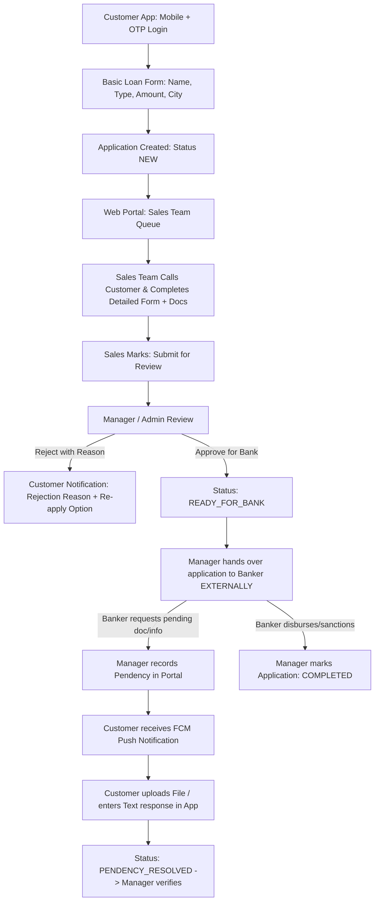

# Loan Application - Product Requirements Document & Technical Architecture

## 1. Project Overview & Scope
- **Project Name**: Loan Application & Lead Collection Management System (Default Brand: **LoanDesk**)
- **Core Scope**: Customer Lead Capture (Flutter Mobile App) + Sales Completion & Manager Quality Review (Web Portal) + External Banker Handoff & Customer Pendency Notification Cycle.
- **Out of Scope (By Design)**: Direct Banking LOS APIs, automatic disbursement webhooks, and automated underwriting sanction engines. External banking processing is conducted outside the software platform.

---

## 2. Design System & Brand Identity (Modern Trust Fintech)
> **Core Tenet**: Avoid flashy gamification or payment-app clones. The UI conveys: *"This is a credible, professional financial institution securely processing my application."*

### Color Palette:
| Token Name | Hex Code | Purpose / Usage |
|---|---|---|
| **Primary** | `#123B6D` | Deep Navy (App bar, Primary buttons, Brand identity) |
| **Primary Dark** | `#0B294D` | Dark Blue (Pressed states, Headers) |
| **Accent / Action** | `#16A085` | Restrained Teal (Action buttons, positive highlights) |
| **Background** | `#F6F8FB` | Cool Light Grey (Scaffold background) |
| **Surface** | `#FFFFFF` | Clean White (Cards, Bottom sheets, Dialogs) |
| **Text Primary** | `#172033` | Dark Charcoal (Headings, Main form labels) |
| **Text Secondary** | `#667085` | Muted Grey (Subtitles, Timestamps, Helper text) |
| **Border / Divider** | `#E4E8EF` | Subtle borders for inputs and cards |
| **Success** | `#168A5B` | Approved / Verified / Resolved states |
| **Warning** | `#D99000` | Pendency / Action Required alerts |
| **Error / Destructive** | `#D64545` | Rejection banners, Field validation errors |

### Visual Design Guidelines:
- **Typography**: Inter / Modern Sans-Serif with legible weight hierarchy.
- **Corners**: Rounded `12px` (Range: 10–14px) on inputs and cards.
- **Elevation**: Minimal elevation (1–2dp) + subtle `1px` border (`#E4E8EF`).
- **Button Height**: `50px` (48–52px) large, tactile touch targets.
- **Grid & Spacing**: Strict 8px grid system (`8, 16, 24, 32, 40`).
- **Web Portal Alignment**: Shared brand palette with higher data density for desktop operations.

---

## 3. Architecture & Monorepo Structure
- **Monorepo Layout**:
  - `mobile/`: Flutter Mobile App (Customer-facing, State Management: BLoC / Cubit)
  - `backend/`: Laravel Web Portal & REST API (Sales/Manager Dashboard, MySQL Database, Sanctum Auth)
- **Role-Based Access Control (RBAC)**:
  1. **Customer**: Mobile + OTP Login (Single active application per mobile number).
  2. **Sales Executive**: Web portal login. Reviews incoming leads, contacts applicant via phone, gathers required documentation, populates client-defined fields, and submits for manager review.
  3. **Manager / Admin**: Global overview. Reviews submitted applications, rejects with mandatory reason, marks "Ready for Bank" for external handoff, and registers banker pendencies requiring customer resolution.

---

## 4. End-to-End Workflow & SOP

---

## 5. Flutter Customer Mobile App Screen Specifications
- **Navigation Model**: **State-Driven Focused Architecture (Zero Navigation Clutter)**. No bottom navigation bar; the app routes directly based on application state:

1. **Screen 1: Login & OTP Verification**:
   - Mobile number input (+91).
   - 6-Digit PIN box with 30s resend timer.
   - Development test bypass (`123456`) enabled for rapid local testing.
   - Micro-copy: *"Secure • Simple • Fast"*.
2. **Screen 2: Apply for Loan (Single Clean Form)**:
   - High-conversion single card layout:
     - Full Name
     - Loan Type Dropdown (Personal, Business, Home, Loan Against Property, Education)
     - Required Loan Amount (INR)
     - City & Pincode
     - (Optional) Referral / Promo Code
   - Instant submission generating Application ID (e.g. `LD-2026-000123`).
3. **Screen 3: Application Status & Timeline**:
   - Status header chip (`Application Submitted`, `Under Review`, `Ready for Bank`).
   - Clean vertical step timeline showing progress.
   - **Rejection Banner**: Red alert card stating exact reason + *"Start Fresh Application"* & *"Contact Support"*.
4. **Screen 4: Pendency Resolution (In-Place Bottom Sheet)**:
   - High-priority banner on Status screen: *"Action Required: Banker has requested [Doc Name]"*.
   - Tap presents a modal bottom sheet:
     - File Picker (PDF, JPG, PNG - max 5MB).
     - Text remarks / explanation input.
     - Submission triggers transition to `PENDENCY_RESOLVED`.

---

## 6. Web Portal Specifications (Sales & Manager)
1. **Sales Executive Module**:
   - Assigned lead pipeline table.
   - Customer dialer/contact view.
   - Comprehensive form builder / field editor to capture customer-provided data.
   - Document attachment manager.
   - State transition: `Submit for Review`.
2. **Manager / Admin Module**:
   - System-wide metrics (New Leads, Under Review, With Banker, Active Pendencies).
   - Review inspection sheet.
   - Rejection dialog requiring mandatory customer-visible justification.
   - Status change to `READY_FOR_BANK`.
   - Pendency management interface (Title, Description, Due Date).

---

## 7. Database Schema
- **`users`**: id, name, email, phone, password, role (`admin`, `manager`, `sales_executive`, `customer`), fcm_token, created_at
- **`loan_types`**: id, name, code, is_active
- **`loan_applications`**:
  - `id`, `application_number` (e.g. `LD-2026-000123`)
  - `customer_id`, `assigned_sales_id`
  - `loan_type_id`, `requested_amount`
  - `applicant_name`, `city`, `pincode`, `referral_code`, `campaign_source`
  - `status` (Enum: `NEW`, `IN_PROGRESS`, `SUBMITTED_FOR_REVIEW`, `READY_FOR_BANK`, `PENDENCY_RAISED`, `PENDENCY_RESOLVED`, `REJECTED`, `COMPLETED`)
  - `rejection_reason` (Text, nullable)
  - `detailed_payload` (JSON structure for sales-collected extended attributes)
  - `created_at`, `updated_at`
- **`application_documents`**: id, application_id, document_type, file_path, uploaded_by_role, created_at
- **`pendencies`**:
  - `id`, `application_id`, `title`, `description`, `status` (`PENDING`, `RESOLVED`)
  - `created_by_user_id`, `customer_response_text`, `customer_response_file`, `resolved_at`, `created_at`
- **`application_activity_logs`**: id, application_id, user_id, action, remarks, created_at
