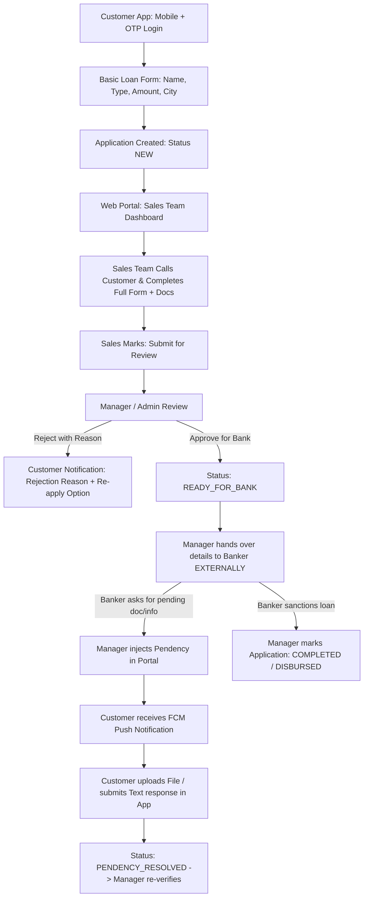

# Loan Application - Product Requirements & Technical Architecture (PRD)

## 📌 1. Project Overview & Business Scope
- **Project Name**: Loan Application & Lead Collection System (Default Brand: **LoanDesk**)
- **Core Scope**: Customer Lead Capture (Flutter Mobile App) + Sales Completion & Manager Review (Web Portal) + Banker External Handoff & Pendency Notification Cycle.
- **Out of Scope (By Design)**: Direct Bank LOS APIs, automatic banking disbursements, or internal bank loan sanctioning. Bank processing completely system ke bahar (externally) handle hoti hai.

---

## 🎨 2. Design System & Theme Guidelines (Modern Trust Fintech)
> **Core Principle**: Ye koi flashy gamified app ya PhonePe/GPay clone nahi hai. Customer ko feel hona chahiye: *"Ye ek professional financial service hai aur meri application safely handle ho rahi hai."*

### Color Palette:
| Token Name | Hex Code | Purpose / Usage |
|---|---|---|
| **Primary** | `#123B6D` | Deep Navy (App bar, Primary buttons, Brand identity) |
| **Primary Dark** | `#0B294D` | Dark Blue (Pressed states, Headers) |
| **Accent / Action** | `#16A085` | Restrained Teal (Action buttons, positive highlights) |
| **Background** | `#F6F8FB` | Cool Light Grey (Scaffold background) |
| **Surface** | `#FFFFFF` | Clean White (Cards, Bottom sheets, Dialogs) |
| **Text Primary** | `#172033` | Dark Charcoal (Headings, Main form labels) |
| **Text Secondary** | `#667085` | Muted Grey (Subtitles, Timestamps, Helper text) |
| **Border / Divider** | `#E4E8EF` | Subtle borders for inputs and cards |
| **Success** | `#168A5B` | Approved / Verified / Resolved states |
| **Warning** | `#D99000` | Pendency / Action Required alerts |
| **Error / Destructive** | `#D64545` | Rejection banners, Field validation errors |

### Visual Design Rules:
- **Typography**: Inter / Modern Sans-Serif with clean hierarchy.
- **Corners**: Rounded `12px` (Range: 10–14px) for all cards and inputs.
- **Elevation**: Minimal elevation (1–2dp) + subtle `1px` border (`#E4E8EF`).
- **Button Height**: `50px` (48–52px) large comfortable touch targets.
- **Spacing**: Strict 8px grid system (`8, 16, 24, 32, 40`).
- **Web Portal Alignment**: Same brand colors, denser data-oriented productivity layout.

---

## 🏛️ 3. Architectural Blueprint & Repository Structure
- **Monorepo Architecture**:
  - `mobile/`: Flutter Mobile App (Customer-facing, State Management: BLoC / Cubit)
  - `backend/`: Laravel Web Portal & REST API (Sales/Manager Dashboard, MySQL Database, Sanctum Auth)
- **Role-Based Access Control (RBAC)**:
  1. **Customer**: Mobile + OTP Login (Single active application per mobile number).
  2. **Sales Executive**: Web portal login. Leads receive karna, customer ko call karke detailed form fill karna, documents upload karna, "Submit for Review" karna.
  3. **Manager / Admin**: Applications review karna, Reject (with mandatory reason) karna, "Ready for Bank" mark karke external banker ko share karna, Banker ki Pendency system me add karna.

---

## 🔄 4. Complete End-to-End Workflow & SOP

---

## 📱 5. Flutter Customer Mobile App Screen Specifications
- **Navigation Model**: **State-Driven Focused Architecture (Zero Navigation Clutter)**. Koi bottom navigation bar nahi hoga; user current state ke hisaab se directly target action par land hoga:

1. **Screen 1: Login & OTP Verification**:
   - Mobile number input with country code (+91).
   - 6-Digit PIN box with 30s resend countdown.
   - Development test bypass (`123456`) enabled for instant development.
   - Trust badge: *"Secure • Simple • Fast"*.
2. **Screen 2: Apply for Loan (Single Clean Form)**:
   - Single-screen high-conversion form:
     - Full Name
     - Loan Type Dropdown (Personal, Business, Home, Loan Against Property, Education)
     - Required Loan Amount (₹)
     - City & Pincode
     - (Optional) Referral / Promo Code
   - Form submission generates Application ID (e.g. `LD-2026-000123`).
3. **Screen 3: Application Status & Timeline**:
   - Status header chip (`Application Submitted`, `Under Review`, `Ready for Bank`).
   - Clean vertical step timeline showing application progression.
   - **Rejection State**: Red warning banner clearly showing Manager's rejection reason + *"Start Fresh Application"* & *"Contact Support"* buttons.
4. **Screen 4: Pendency Resolution (In-Place Bottom Sheet)**:
   - In-place high-visibility warning card on Status screen: *"Action Required: Banker has requested [Doc Name]"*.
   - Tap karne par modal bottom-sheet open hogi:
     - File Picker (PDF/JPG/PNG - max 5MB).
     - Text remarks / explanation input.
     - Submit button -> Real-time status update to `PENDENCY_RESOLVED`.

---

## 💻 6. Web Portal Specifications (Sales & Manager)
1. **Sales Executive Module**:
   - Table of assigned leads.
   - Customer dialer/contact view.
   - Extended form editor: Personal details, Employment, Income, Existing EMIs, Document uploads.
   - Button: `Submit for Review`.
2. **Manager / Admin Module**:
   - Global dashboard & lead pipeline counters.
   - Application Review Modal with complete information & attached documents.
   - Action 1: `Reject Application` (requires mandatory text reason, e.g. "Low CIBIL score").
   - Action 2: `Mark Ready for Bank` (sets status for external handoff).
   - Action 3: `Add Banker Pendency` (Title, Description, Document type requested, Due date).
   - Action 4: `Mark Completed / Disbursed`.

---

## 🗄️ 7. Database Schema & Tables
- **`users`**: id, name, email, phone, password, role (`admin`, `manager`, `sales_executive`, `customer`), fcm_token, created_at
- **`loan_types`**: id, name, code, is_active
- **`loan_applications`**:
  - `id`, `application_number` (e.g. `LD-2026-000123`)
  - `customer_id`, `assigned_sales_id`
  - `loan_type_id`, `requested_amount`
  - `applicant_name`, `city`, `pincode`, `referral_code`, `campaign_source`
  - `status` (Enum: `NEW`, `IN_PROGRESS`, `SUBMITTED_FOR_REVIEW`, `READY_FOR_BANK`, `PENDENCY_RAISED`, `PENDENCY_RESOLVED`, `REJECTED`, `COMPLETED`)
  - `rejection_reason` (Text, nullable)
  - `detailed_payload` (JSON structure for sales-collected extended attributes)
  - `created_at`, `updated_at`
- **`application_documents`**: id, application_id, document_type, file_path, uploaded_by_role, created_at
- **`pendencies`**:
  - `id`, `application_id`, `title`, `description`, `status` (`PENDING`, `RESOLVED`)
  - `created_by_user_id`, `customer_response_text`, `customer_response_file`, `resolved_at`, `created_at`
- **`application_activity_logs`**: id, application_id, user_id, action, remarks, created_at
