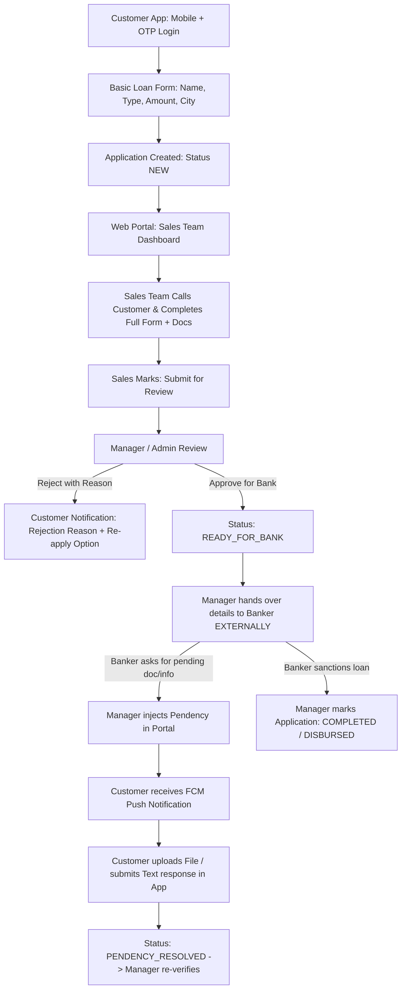

# Loan Application - Product Requirements & Technical Architecture (PRD)

## 📌 1. Project Overview & Business Scope
- **Project Name**: Loan Application & Lead Collection System
- **Core Scope**: Customer Lead Capture (Flutter Mobile App) + Sales Completion & Manager Review (Web Portal) + Banker External Handoff & Pendency Notification Cycle.
- **Out of Scope (By Design)**: Direct Bank LOS APIs, automatic banking disbursements, or internal bank loan sanctioning. Bank processing completely system ke bahar (externally) handle hoti hai.

---

## 🏛️ 2. Architectural Blueprint & Repository Structure
- **Monorepo Architecture**:
  - `mobile/`: Flutter Mobile App (Customer-facing, State Management: BLoC / Cubit)
  - `backend/`: Laravel Web Portal & REST API (Sales/Manager Dashboard, MySQL Database, Sanctum Auth)
- **Role-Based Access Control (RBAC)**:
  1. **Customer**: Mobile + OTP Login (Single active application per mobile number).
  2. **Sales Executive**: Web portal login. Leads receive karna, customer ko call karke detailed form fill karna, documents upload karna, "Submit for Review" karna.
  3. **Manager / Admin**: Applications review karna, Reject (with mandatory reason) karna, "Ready for Bank" mark karke external banker ko share karna, Banker ki Pendency system me add karna.

---

## 🔄 3. Complete End-to-End Workflow & SOP

---

## 🧩 4. Application Lifecycle & State Machine
| Status Code | Description | Next Allowed State | Allowed Roles |
|---|---|---|---|
| `NEW` | Customer ne mobile app se basic details submit ki | `IN_PROGRESS` | System / Sales |
| `IN_PROGRESS` | Sales executive lead par work kar raha hai (calling & collecting docs) | `SUBMITTED_FOR_REVIEW` | Sales Executive |
| `SUBMITTED_FOR_REVIEW` | Sales ne full details complete karke manager ko submit ki | `UNDER_REVIEW`, `READY_FOR_BANK`, `REJECTED` | Sales / Manager |
| `UNDER_REVIEW` | Manager application audit kar raha hai | `READY_FOR_BANK`, `REJECTED` | Manager / Admin |
| `READY_FOR_BANK` | Details verified; external banker ko share ki gayi | `PENDENCY_RAISED`, `COMPLETED`, `REJECTED` | Manager / Admin |
| `PENDENCY_RAISED` | Banker ne missing doc/info mangi; Customer ko alert bheja gaya | `PENDENCY_RESOLVED` | Manager / Admin |
| `PENDENCY_RESOLVED` | Customer ne required doc/info mobile app se submit kar di | `READY_FOR_BANK`, `PENDENCY_RAISED` | Customer / Manager |
| `REJECTED` | Manager ne reason ke saath reject kiya (Customer can re-apply) | `NEW` (on re-apply) | Manager / Admin |
| `COMPLETED` | Loan banker ke dwara successfully disburse / close ho gaya | Terminal State | Manager / Admin |

---

## 📱 5. Flutter Customer Mobile App Specifications
1. **Authentication**:
   - Mobile Number input -> SMS OTP verification -> JWT / Sanctum Bearer token.
2. **Dynamic Routing / Landing Logic**:
   - Agar customer ka koi **active application** nahi hai -> `ApplyLoanScreen`
   - Agar customer ka application already **In-Progress / Under Review / Ready for Bank** hai -> `ApplicationStatusDashboard`
   - Agar application **REJECTED** hai -> Rejection Reason Banner + "Start Fresh Application" button + "Contact Support" action.
3. **Basic Application Form (Modular Design)**:
   - Full Name
   - Loan Type (Personal, Business, Home, Mortgage, etc.)
   - Required Amount (₹)
   - City / Pincode
   - Optional Promo / Referral Code (Marketing lead attribution)
4. **Pendency Resolution Module**:
   - Alert Banner: "Action Required: Banker has requested additional details"
   - Upload Attachment (PDF, JPG, PNG - max 5MB)
   - Remarks / Text Explanation field
   - Submit response button (instantly updates manager portal)
5. **Notifications**:
   - Firebase Cloud Messaging (FCM) background/foreground push alerts.
   - In-app Notification list & status badges.

---

## 💻 6. Web Portal Specifications (Sales & Manager)
1. **Sales Executive View**:
   - Table of assigned leads.
   - Click to view customer phone & basic info.
   - Extended form editor: Personal details, Employment, Income, Existing EMIs, Document uploads.
   - Button: `Submit for Review`.
2. **Manager / Admin View**:
   - Global dashboard & lead pipeline counters.
   - Application Review Modal with complete information & attached documents.
   - Action 1: `Reject Application` (requires mandatory text reason, e.g. "Low CIBIL score").
   - Action 2: `Mark Ready for Bank` (sets status for external handoff).
   - Action 3: `Add Banker Pendency` (Title, Description, Document type requested, Due date).
   - Action 4: `Mark Completed / Disbursed`.

---

## 🗄️ 7. Database Schema & Tables
- **`users`**: id, name, email, phone, password, role (`admin`, `manager`, `sales_executive`, `customer`), fcm_token, created_at
- **`loan_types`**: id, name, code, is_active
- **`loan_applications`**:
  - `id`, `application_number` (e.g. `LN-2026-0001`)
  - `customer_id`, `assigned_sales_id`
  - `loan_type_id`, `requested_amount`
  - `applicant_name`, `city`, `pincode`, `referral_code`, `campaign_source`
  - `status` (Enum: `NEW`, `IN_PROGRESS`, `SUBMITTED_FOR_REVIEW`, `READY_FOR_BANK`, `PENDENCY_RAISED`, `PENDENCY_RESOLVED`, `REJECTED`, `COMPLETED`)
  - `rejection_reason` (Text, nullable)
  - `detailed_payload` (JSON or dedicated columns for sales-filled fields)
  - `created_at`, `updated_at`
- **`application_documents`**: id, application_id, document_type, file_path, uploaded_by_role, created_at
- **`pendencies`**:
  - `id`, `application_id`, `title`, `description`, `status` (`PENDING`, `RESOLVED`)
  - `created_by_user_id`, `customer_response_text`, `customer_response_file`, `resolved_at`, `created_at`
- **`application_activity_logs`**: id, application_id, user_id, action, remarks, created_at
